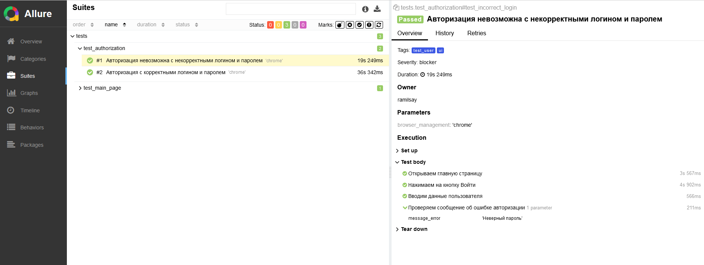
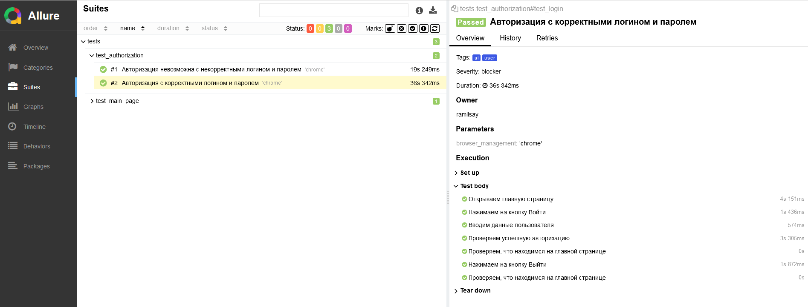
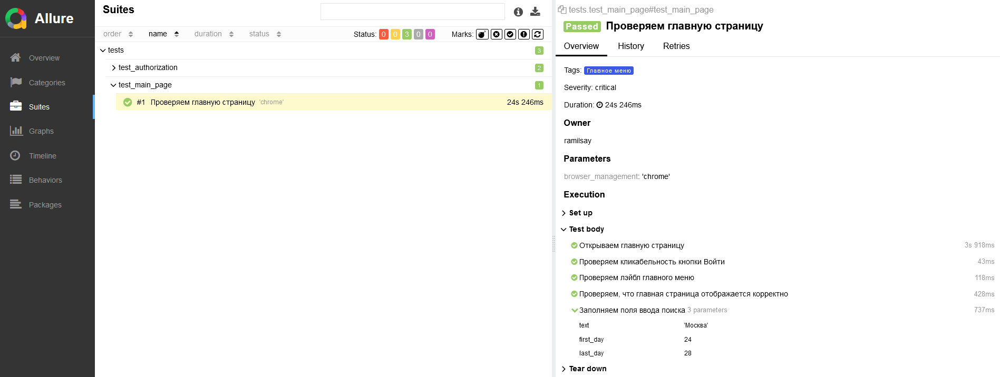

# Демонстрационный проект https://travel.yandex.ru/

<code></code>
<code></code>
<code></code>
<code></code>
<code></code>
<code></code>
<code></code>

## Запуск тестов
### Запуск тестов локально
1. Клонировать репозиторий
```
git clone git@github.com:RamilSay/project_travel_yandex.git
```
2. Перейти в папку
```
cd pythonProject
```
3. Инициализировать виртуальное окружение
```
python -m venv venv
```
4. Активировать виртуальное окружение
```
source ./venv/bin/activate
```
5. Установить зависимости
```
pip install -r requirements.txt
```
6. Положить .env файл в папку с проектом
```
NAME = 'any_name'
EMAIL = 'any_email'
PASSWORD = 'any_password'

```
7. Запустить тесты
```
python -m pytest
```
## Allure отчеты



